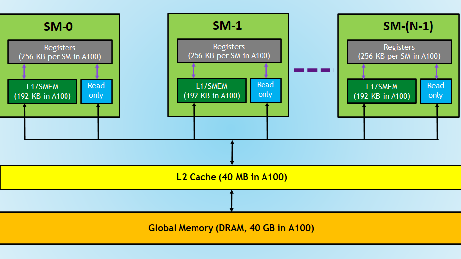
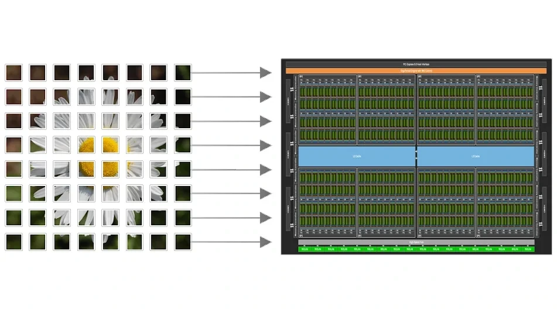

# Week 3: Memory Hierarchy (Global & Shared Memory)

> **핵심 문제**: "Compute는 공짜, Memory는 비싸다"  
> **목표**: GPU Memory Hierarchy를 이해하고 Shared Memory를 활용한 최적화 기법 습득

---

## 📊 GPU Memory Hierarchy (메모리 계층)

GPU의 메모리는 **속도와 용량의 트레이드오프**를 가진 계층 구조로 이루어져 있습니다.



```
🏔️ Memory Pyramid (위로 갈수록 빠름)

      Register         ← 가장 빠름 (1 cycle)
        |              ← Thread 전용, 수십 KB
    ----+----
   Shared Memory       ← 매우 빠름 (1~32 cycles)  ⭐ 프로그래머 제어 가능!
        |              ← Block 공유, 48~164 KB
    ----+----
   L1/L2 Cache         ← 빠름 (32~200 cycles)
        |              ← 하드웨어 관리, 수 MB
    ----+----
   Global Memory       ← 느림 (200~800 cycles)  ⚠️ 병목!
        |              ← 모든 Grid 공유, 수십 GB
    ----+----
     CPU RAM           ← 매우 느림 (PCIe 통신)
```

### 핵심 통찰 (Key Insight)

**문제**: Global Memory는 느리지만 데이터가 많다.  
**해결**: 자주 쓰는 데이터를 Shared Memory로 옮겨서 재사용한다! (**Tiling**)

---

## 🚀 Global Memory Coalescing (합성 접근)

### Coalescing이란?

DRAM은 **연속된 주소를 한 번에 읽는 것(Burst Access)** 이 효율적입니다.  
GPU의 Warp(32 threads)가 메모리를 읽을 때도 마찬가지입니다.

```cpp
// ✅ GOOD: Coalesced Access (합성 접근)
__global__ void coalesced_kernel(float* data) {
    int i = blockIdx.x * blockDim.x + threadIdx.x;
    float val = data[i];  // Thread 0→data[0], Thread 1→data[1], ...
    // 32개 스레드가 연속된 메모리를 읽음 → 한 번의 Memory Transaction
}

// ❌ BAD: Strided Access (보폭 접근)
__global__ void strided_kernel(float* data, int stride) {
    int i = blockIdx.x * blockDim.x + threadIdx.x;
    float val = data[i * stride];  // Thread 0→data[0], Thread 1→data[stride], ...
    // 32개 스레드가 띄엄띄엄 메모리를 읽음 → 32번의 Memory Transaction
}
```

**성능 차이**: Strided Access는 Coalesced Access보다 **10~32배 느릴 수 있습니다**.

---

## 🧩 Matrix Multiplication과 Tiling

### Naive Matrix Multiplication의 문제점

행렬 곱셈 C = A × B에서 각 `C[row][col]`을 계산하려면:

```cpp
// C[row][col] = A[row][0]*B[0][col] + A[row][1]*B[1][col] + ... + A[row][K-1]*B[K-1][col]

__global__ void matmul_naive(float* A, float* B, float* C, int N) {
    int row = blockIdx.y * blockDim.y + threadIdx.y;
    int col = blockIdx.x * blockDim.x + threadIdx.x;
    
    if (row < N && col < N) {
        float sum = 0.0f;
        for (int k = 0; k < N; k++) {
            sum += A[row * N + k] * B[k * N + col];  // ⚠️ Global Memory 접근
        }
        C[row * N + col] = sum;
    }
}
```

**문제점**:
- `A[row * N + k]`와 `B[k * N + col]`을 **매번 Global Memory에서** 읽어옴
- 같은 데이터를 여러 번 읽는 비효율 발생
- Memory Bandwidth가 병목이 됨

### Tiled Matrix Multiplication (해결책)



**아이디어**: 큰 행렬을 작은 "타일(Tile)" 단위로 쪼개서, **Shared Memory에 올려두고 재사용**하자!

```cpp
#define TILE_SIZE 16

__global__ void matmul_tiled(float* A, float* B, float* C, int N) {
    // Shared Memory 선언 (Block 내 모든 Thread가 공유)
    __shared__ float As[TILE_SIZE][TILE_SIZE];
    __shared__ float Bs[TILE_SIZE][TILE_SIZE];
    
    int row = blockIdx.y * blockDim.y + threadIdx.y;
    int col = blockIdx.x * blockDim.x + threadIdx.x;
    
    float sum = 0.0f;
    
    // 타일 단위로 반복
    for (int tile = 0; tile < (N + TILE_SIZE - 1) / TILE_SIZE; tile++) {
        // 1단계: Global → Shared Memory로 데이터 로딩
        if (row < N && (tile * TILE_SIZE + threadIdx.x) < N) {
            As[threadIdx.y][threadIdx.x] = A[row * N + tile * TILE_SIZE + threadIdx.x];
        } else {
            As[threadIdx.y][threadIdx.x] = 0.0f;
        }
        
        if (col < N && (tile * TILE_SIZE + threadIdx.y) < N) {
            Bs[threadIdx.y][threadIdx.x] = B[(tile * TILE_SIZE + threadIdx.y) * N + col];
        } else {
            Bs[threadIdx.y][threadIdx.x] = 0.0f;
        }
        
        // 2단계: 동기화 (모든 Thread가 로딩 완료될 때까지 대기)
        __syncthreads();
        
        // 3단계: Shared Memory에서 연산 수행
        for (int k = 0; k < TILE_SIZE; k++) {
            sum += As[threadIdx.y][k] * Bs[k][threadIdx.x];  // ⚡ Fast!
        }
        
        // 4단계: 다음 타일로 넘어가기 전 동기화
        __syncthreads();
    }
    
    // 결과를 Global Memory에 저장
    if (row < N && col < N) {
        C[row * N + col] = sum;
    }
}
```

### Tiling의 성능 향상 원리

1. **데이터 재사용**: 같은 타일의 데이터를 여러 번 쓸 때 Shared Memory에서 빠르게 읽음
2. **Memory Transaction 감소**: Global Memory 접근 횟수가 줄어듦
3. **Cache Locality 향상**: 작은 타일 단위로 작업하므로 캐시 효율성 증가

**이론적 성능 향상**: 타일 크기가 16×16일 때 최대 **16배** 빨라질 수 있음!

---

## ⚠️ 주의사항: `__syncthreads()`

```cpp
__syncthreads();  // Block 내 모든 Thread 동기화
```

**언제 써야 하는가?**
- Shared Memory에 데이터를 쓴 후, 다른 Thread가 읽기 전
- Shared Memory에서 데이터를 읽은 후, 덮어쓰기 전

**주의사항**:
- **조건문 안에서 사용 금지!** 일부 Thread만 도달하면 Deadlock 발생
- 성능 오버헤드가 있으므로 꼭 필요한 곳에만 사용

---

## 🧮 Bank Conflicts (고급 주제)

Shared Memory는 내부적으로 32개의 "Bank"로 나뉘어져 있습니다.  
같은 Bank에 동시 접근하면 **Bank Conflict**가 발생하여 성능이 저하됩니다.

```cpp
// ❌ BAD: Bank Conflict
__shared__ float shared[32][32];
// Thread 0, 1, 2, ... 모두 shared[0][0], shared[0][1], shared[0][2] 접근
// → 모두 Bank 0에 몰림

// ✅ GOOD: No Bank Conflict  
__shared__ float shared[32][33];  // +1 Padding으로 Bank 분산
```

**해결책**: 보통 Shared Memory 배열의 두 번째 차원에 +1 패딩을 추가합니다.

---

## 📊 성능 비교 예상 결과

| 구현 방식 | 행렬 크기 512×512 | 행렬 크기 2048×2048 | 비고 |
|----------|------------------|-------------------|------|
| Naive MatMul | ~5 ms | ~80 ms | Baseline |
| Tiled MatMul | ~1 ms | ~15 ms | **5~6배 빠름** |
| cuBLAS (참고) | ~0.2 ms | ~3 ms | 고도 최적화 버전 |

---

## 🔗 참고 자료 및 최신 동향

### 추천 도서
- **PMPP (Programming Massively Parallel Processors)** Chapter 4-5: Memory 계층과 Tiling 기법

### 최신 기술 동향
- **NVIDIA cuTile**: 타일 기반 연산을 자동화해주는 새로운 프로그래밍 모델 (2024~)
- **OpenAI Triton**: 비슷한 목적으로, Tiling 코드를 자동 생성해주는 고수준 언어

*→ 이런 도구들이 나오는 이유가 바로 수동 Tiling이 어렵기 때문입니다. 하지만 원리를 알아야 도구를 제대로 쓸 수 있죠!*

---

## 🚀 이번 주 실습 및 과제

### 실습 파일
1. **`lecture3_coalescing.py`**: Memory 접근 패턴에 따른 성능 차이 체험
2. **`lecture3_matmul_naive.py`**: Baseline 행렬 곱셈 구현
3. **`lecture3_matmul_tiled.py`**: Shared Memory Tiling 구현

### 과제
- **`lecture3_hw_transpose.py`**: 행렬 전치(Transpose) 최적화
  - Naive 버전과 Shared Memory 버전 비교
  - Coalescing을 깨뜨리기 쉬운 연산의 최적화 경험

---

## 💡 핵심 포인트

1. **Memory는 GPU 성능의 핵심 병목**입니다.
2. **Shared Memory + Tiling = 가장 중요한 최적화 기법**입니다.
3. **`__syncthreads()`는 양날의 검**입니다. 꼭 필요할 때만 써야 합니다.
4. **Coalesced Access**를 항상 염두에 둬야 합니다.

다음 주(Week 4)에서는 이런 최적화 효과를 정확히 측정하는 **Profiling** 기법을 배웁니다. 💪

---

*Week 3을 통해 GPU의 "두뇌"를 이해하시길 바랍니다! 🧠⚡*
